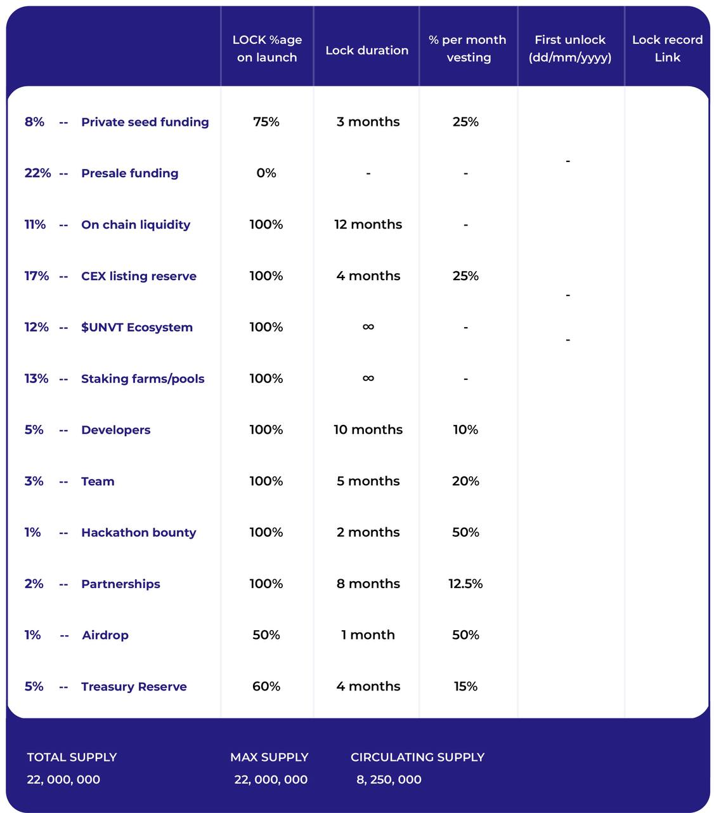

# Uninomics

<figure><figcaption></figcaption></figure>

```
Distribution      %total    %🔓launch    🔓duration    %p/m vesting   🔓(dd/mm/yyyy)
```

Private seed funding    - 8%          75%                  3 months           25%

Presale funding            - 22%         0%                    -                          -                          -

On chain liquidity         - 11%          100%                12 months           -

CEX listing reserve      - 17%          100%                4 months            25%

$UNVT Ecosystem      - 12%          100%                ∞                         -                         -

Staking farms/pools    - 13%          100%                ∞                         -                         -

Developers                   - 5%            100%               10 months          10%

Team                             - 3%            100%               5 months            20%

Hackathon bounty       - 1%             100%               2 months            50%

Partnerships                - 2%             100%               8 months            12.5%

Airdrop                         - 1%              50%                1 month               50%

Treasury Reserve        - 5%             60%                4 months             15%
